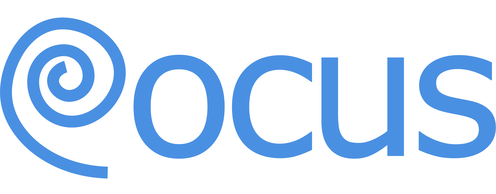

# Rocus



**Rocus** is an intelligent, AI-powered knowledge graph that automatically organizes your saved websites using local machine learning models. Built with Vue.js, D3.js, and WebGPU-accelerated AI, Rocus runs entirely in your browser—no servers, no cloud, complete privacy.

---

## Features

- **Local AI Processing**: Uses WebGPU-accelerated models that run directly in your browser
- **Interactive Knowledge Graph**: Visualize relationships between your saved content with D3.js
- **Smart Organization**: Automatically clusters similar websites using embeddings and semantic analysis
- **20+ Themes**: Beautiful, customizable color schemes including "Girly Pop", "Popped Out 80's", and more
- **Search**: Find anything instantly with semantic search
- **Extension**: Save websites with one click
- **Local Storage**: All data stored in IndexedDB—your data never leaves your device
- **Offline First**: Works completely offline after initial model download
- **Import/Export**: Backup and restore your entire knowledge graph

---

### Prerequisites

**Browser Support**: Rocus requires a modern browser with **WebGPU support**. Check if your browser is supported:

- **Chrome/Edge**: Version 113+ ✅
- **Firefox**: Version 121+ (experimental) ⚠️
- **Safari**: Version 18+ (macOS Sequoia+) ⚠️

**Check WebGPU Support**: Visit [WebGPU Report](https://webgpureport.org/) to verify your browser and GPU compatibility.

**Hardware Requirements**:
- GPU with WebGPU support (most modern GPUs from 2018+)
- Recommended: 8GB+ RAM
- 2GB free disk space (for model caching)

### Installation

1. **Clone the repository**:
```bash
   git clone https://github.com/Othmanali02/rocus.git
   cd rocus
```

2. **Install dependencies**:
```bash
   npm install
```

3. **Run the development server**:
```bash
   npm run dev
```

4. **Open in browser**:
   Navigate to `http://localhost:5173`

### First Launch

On first launch, Rocus will:
1. Download AI models (~150MB) - this happens once then it is cached on your browser
2. Cache models in your browser for offline use
3. Show an interactive tutorial

**Note**: Initial model download may take 2-5 minutes depending on your connection.

---

## How It Works

### Architecture Overview
```
┌─────────────────────────────────────────────────────────┐
│                     Browser (Client)                    │
├─────────────────────────────────────────────────────────┤
│                                                         │
│  ┌──────────────┐  ┌─────────────┐  ┌──────────────┐    │
│  │   Vue.js     │  │   D3.js     │  │  IndexedDB   │    │
│  │   (UI)       │  │  (Graph)    │  │  (Storage)   │    │
│  └──────────────┘  └─────────────┘  └──────────────┘    │
│                                                         │
│  ┌──────────────────────────────────────────────────┐   │
│  │          WebGPU-Accelerated AI Models            │   │
│  ├──────────────────────────────────────────────────┤   │
│  │  • Web-LLM (Qwen2.5-0.5B) - Summarization        │   │
│  │  • Transformers.js (MiniLM) - Embeddings         │   │
│  └──────────────────────────────────────────────────┘   │
│                                                         │
└─────────────────────────────────────────────────────────┘
```

### AI Processing Pipeline

When you save a website via the browser extension:

1. **Content Extraction**: The extension captures page metadata and text content
2. **Summarization** ([Web-LLM](https://github.com/mlc-ai/web-llm)): A 0.5B parameter language model (Qwen2.5) running on your GPU generates a 2-3 sentence summary
3. **Topic Extraction**: The LLM identifies 1-2 word topics describing the content
4. **Embedding Generation** ([Transformers.js](https://github.com/xenova/transformers.js)): MiniLM-L6 converts the summary into a 384-dimensional vector
5. **Clustering**: Cosine similarity groups semantically related websites together
6. **Graph Update**: New nodes and connections are added to your knowledge graph

**All of this happens locally on your machine. No data is sent to external servers.**

### Technology Stack

- **Frontend**: Vue.js 3 (Composition API)
- **Visualization**: D3.js v7
- **AI Models**:
  - [Web-LLM](https://github.com/mlc-ai/web-llm) - WebGPU-accelerated LLM inference
  - [Transformers.js](https://github.com/xenova/transformers.js) - ONNX Runtime for embeddings
- **Storage**: IndexedDB with file storage import and export
- **Styling**: Tailwind CSS
- **Extension**: Manifest V3 Chrome Extension

---

## User Guide

### Basic Workflow

1. **Install Browser Extension**: Load the extension from Google Chrome or your favorite browser supporting webgpu
2. **Browse the Web**: Navigate to any website you want to save
3. **Click Extension Icon**: Choose an album or "Quick Save"
4. **Watch the Magic**: Rocus automatically:
   - Analyzes the content
   - Generates summaries
   - Finds similar content
   - Creates/updates clusters
   - Updates your knowledge graph

### Albums

**Albums** organize clusters by project, topic, or any category you choose.

- **Create Album**: Click albums dropdown → "Create New Album"
- **Assign Content**: Save websites to specific albums via the extension
- **Switch Views**: Use the dropdown to filter by album or view "All Clusters"

### Interacting with the Graph

- **Zoom**: Mouse wheel or pinch gesture
- **Pan**: Click and drag background
- **Explode Cluster**: Click any node to see individual websites
- **Right-Click Menu**:
  - Rename cluster
  - Add websites from database
  - Remove websites
  - Delete cluster
- **Search**: Use the search bar to find clusters/websites instantly

### Themes

Click the theme button (palette icon) to choose from 15+ themes:

### Data Management

**Export**: Settings → Export All Data → Saves `.rocus` file with all clusters, websites, embeddings

**Import**: Settings → Import Data → Restores from `.rocus` backup file

**⚠️ Warning**: Import replaces ALL current data. Backup first!

---

## Configuration

### Environment Variables

For the Google Search API integration (similar websites discovery):
```env
GOOGLE_API_KEY=your_google_api_key
GOOGLE_CX=your_custom_search_engine_id
```

**Note**: This is optional. Without it, "Discover Similar" uses local embeddings only.

### Cloudflare Worker Setup

For privacy and security, deploy the Google Search proxy as a Cloudflare Worker:

1. Create a Cloudflare Worker from `./worker/google-search-proxy.js`
2. Add environment variables in Cloudflare Dashboard
3. Update `GOOGLE_SEARCH_WORKER_URL` in `GraphNode.vue`

---

## Browser Compatibility

| Browser | Version | WebGPU Support | Status |
|---------|---------|----------------|--------|
| Chrome  | 113+    | ✅ Stable      | ✅ Recommended |
| Edge    | 113+    | ✅ Stable      | ✅ Recommended |
| Firefox | 121+    | ⚠️ Experimental | ⚠️ Limited |
| Safari  | 18+     | ⚠️ Beta        | ⚠️ Limited |
| Opera   | 99+     | ✅ Stable      | ✅ Supported |

**Check compatibility**: [Can I Use WebGPU](https://caniuse.com/webgpu)

**Test your browser**: [WebGPU Report](https://webgpureport.org/)

### Fallbacks

If WebGPU is unavailable:
- Rocus will attempt to use WASM (slower, but functional)
- Some features may be degraded
- You'll see a warning in the console

---

## Development

### Project Structure
```
rocus/
├── src/
│   ├── components/
│   │   ├── GraphNode.vue      # Main graph visualization
│   │   └── images/            # Assets
│   ├── App.vue
│   └── main.js
├── extension/
│   ├── manifest.json
│   ├── popup.html
│   ├── popup.js
│   └── content.js
├── worker/
│   └── google-search-proxy.js # Cloudflare Worker
└── README.md
```

### Building for Production
```bash
npm run build
```

Output will be in `./dist`

### Extension Development

1. Load unpacked extension from `./extension` folder in Chrome
2. Make changes to extension files
3. Reload extension in `chrome://extensions`

---

## Contributing

Contributions are welcome! Please:

1. Fork the repository
2. Create a feature branch (`git checkout -b feature/super-cool-feature`)
3. Commit your changes (`git commit -m 'Add super cool feature'`)
4. Push to the branch (`git push origin feature/super-cool-feature`)
5. Open a Pull Request

---

## License

This project is licensed under the MIT License - see the [LICENSE](LICENSE) file for details.

---

## Acknowledgments

- [Web-LLM](https://github.com/mlc-ai/web-llm) - WebGPU LLM inference
- [Transformers.js](https://github.com/xenova/transformers.js) - In-browser ML models
- [D3.js](https://d3js.org/) - Data visualization
- [Vue.js](https://vuejs.org/) - Progressive framework

---

## Support

- **Issues**: [GitHub Issues](https://github.com/Othmanali02/rocus/issues)
- **Discussions**: [GitHub Discussions](https://github.com/Othmanali02/rocus/discussions)
- **Email**: othman.internet@gmail.com (if applicable)

## Privacy

**Rocus is privacy-first by design:**

- ✅ All processing happens locally in your browser
- ✅ No data sent to external servers (except optional Google Search API)
- ✅ No tracking, analytics, or telemetry
- ✅ All data stored in local IndexedDB
- ✅ Open source - audit the code yourself

## Privacy-First Analytics

### What We Collect

Rocus uses **[Umami](https://umami.is/)**, a privacy-first, open-source analytics platform, to understand how people use the application. **You must explicitly opt-in** via the consent banner.

**If you consent, we collect:**
- Anonymous page views and button clicks
- Feature usage patterns (e.g., "cluster was exploded")
- Error occurrences to identify bugs
- Browser type and screen size
- Country-level location (derived from IP, not stored)

**We NEVER collect:**
- Your website URLs, titles, or content
- Your cluster names or topics
- Your search queries or any personal data
- IP addresses (not stored)
- Cookies or tracking identifiers
- Device fingerprints
- Any cross-site tracking data

### Why the Analytics?

Anonymous analytics help us:
- Identify which features are most valuable
- Discover bugs and edge cases
- Understand clustering mistakes
- Prioritize improvements
- Support more browsers and devices

### You have full Control

- **Opt out anytime**: Settings → "Help Improve Rocus" toggle off
- **We respect DNT**: Do Not Track browser header is honored
- **Review our code**: See exactly what's tracked in `src/composables/useAnalytics.js`
- **Self-hosted**: Our analytics run on our own server, not third-party services.

### For Privacy Enthusiasts

Rocus is designed with privacy principles
- No surveillance capitalism
- No data brokering
- No dark patterns
- Full transparency
- User control above all else

See our full Privacy Policy for details.